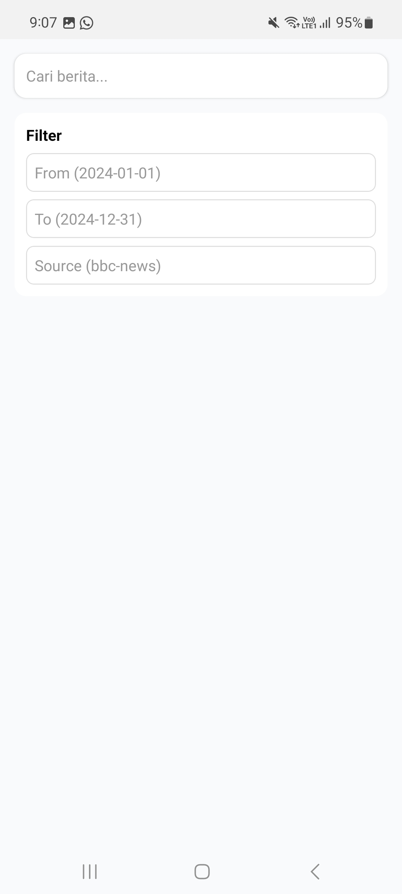

## Berita App

- **Nama** : Zulfikar Hasan  
- **NIM** : 2410501016  

---

Project ini adalah aplikasi berita yang dibangun dengan konsep API Integration & Data Fetching. 
Aplikasi ini memungkinkan user untuk melihat berbagai berita terbaru berdasarkan kategori, melakukan pencarian, 
menyimpan artikel favorit.

---

## Fitur Utama

* Home screen dengan kategori berita (Technology, Sports, Business, Health)
* Search berita dengan debounce (biar gak spam API)
* Detail artikel menggunakan WebView
* Bookmark artikel ke AsyncStorage
* Pull-to-refresh dan infinite scroll
* Offline mode menggunakan cached data

---

## Pengembangan Lanjutan

* **Bookmark Offline**
  Artikel yang disimpan bakal masuk ke AsyncStorage, jadi walaupun offline masih bisa dibuka dari BookmarkScreen.

* **Search dengan Debounce (500ms)**
  Implementasi pakai custom hook `useNewsSearch`, jadi request ke API gak dilakukan setiap user ngetik, tapi ditunggu dulu 500ms biar lebih efisien.

* **Filter Berita**
  Bisa filter berdasarkan source (sumber berita) dan juga rentang tanggal (from - to), jadi hasil pencarian lebih spesifik.

* **Dark Mode**
  Pakai `useColorScheme` + React Context, dan disimpan ke AsyncStorage juga, jadi preferensi user tetap keinget.

* **Share Artikel**
  User bisa share link berita pakai `expo-sharing`, jadi bisa langsung dibagikan ke aplikasi lain.

## Dependencies

* React Native
* Axios
* React Query (@tanstack/react-query)
* AsyncStorage
* expo-constants
* react-native-webview
* expo-sharing

---

## Screenshot Preview

<p>
  
  
  
  
</p>

---
## Cara Menjalankan

Aplikasi ini menggunakan **Expo**.

### 1. Clone Repository
```bash
git clone <URL_REPOSITORY>
```

### 3. Install Expo
```bash
npm install expo
```

### 4. Jalankan Aplikasi
```bash
npx expo start
```
